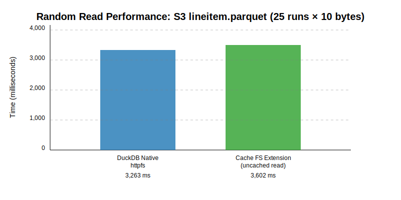

# duck-read-cache-fs

## Introduction

This repository is made as read-only filesystem for remote access, which serves as cache layer above duckdb [httpfs](https://github.com/duckdb/duckdb-httpfs).

Key features:
- Caching, which adds support for remote file access to improve IO performance and reduce egress cost; several caching options are supported
  + in-memory, cache fetched file content into blocks and leverages a LRU cache to evict stale blocks
  + on-disk (default), already read blocks are stored to load filesystem, and evicted on insufficient disk space based on their access timestamp
  + no cache, it's allowed to disable cache and fallback to httpfs without any side effects
- Parallel read, read operations are split into size-tunable chunks to increase cache hit rate and improve performance
- Profiling helps us to understand system better, key metrics measured include cache access stats, and IO operation latency, we plan to support multiple types of profile result access; as of now there're three types of profiling
  + temp, all access stats are stored in memory, which could be retrieved via `SELECT cache_httpfs_get_profile();`
  + duckdb (under work), stats are stored in duckdb so we could leverage its rich feature for analysis purpose (i.e. use histogram to understant latency distribution)
  + profiling is by default disabled
- Compatibility with duckdb `httpfs`
  + Extension is built upon `httpfs` extension and load it beforehand, so it's fully compatible with it; we provide option `SET cache_httpfs_type='noop';` to fallback to no cache and parallel IO version, which fallbacks to and behaves exactly as httpfs.

## Example usage
```sql
-- No need to load httpfs.
D LOAD read_cache_fs;
-- Create S3 secret to access objects.
D CREATE SECRET my_secret (      TYPE S3,      KEY_ID '<key>',      SECRET '<secret>',      REGION 'us-east-1',      ENDPOINT 's3express-use1-az6.us-east-1.amazonaws.com');
┌─────────┐
│ Success │
│ boolean │
├─────────┤
│ true    │
└─────────┘
-- Set cache type to in-memory.
D SET cache_httpfs_type='in_mem';
D SELECT * FROM 's3://s3-bucket-user-2skzy8zuigonczyfiofztl0zbug--use1-az6--x-s3/t.parquet';
┌───────┬───────┐
│   i   │   j   │
│ int64 │ int64 │
├───────┼───────┤
│     0 │     1 │
│     1 │     2 │
│     2 │     3 │
│     3 │     4 │
│     4 │     5 │
├───────┴───────┤
│    5 rows     │
└───────────────┘
-- Check cache status.
D SELECT cache_httpfs_get_cache_size();
┌───────────────────────────────┐
│ cache_httpfs_get_cache_size() │
│             int64             │
├───────────────────────────────┤
│             16821             │
└───────────────────────────────┘
```

## Setting and util functions

A rich set of parameters and util functions are provided for the above features, including but not limited to type of caching, IO request size, etc.
Checkout by
```sql
-- Get all extension configs.
SELECT * FROM duckdb_settings() WHERE name LIKE 'cache_httpfs%';
-- Get all extension util functions.
SELECT * FROM duckdb_functions() WHERE function_name LIKE 'cache_httpfs%';
```

## [More About Benchmark](/benchmark/README.md)


